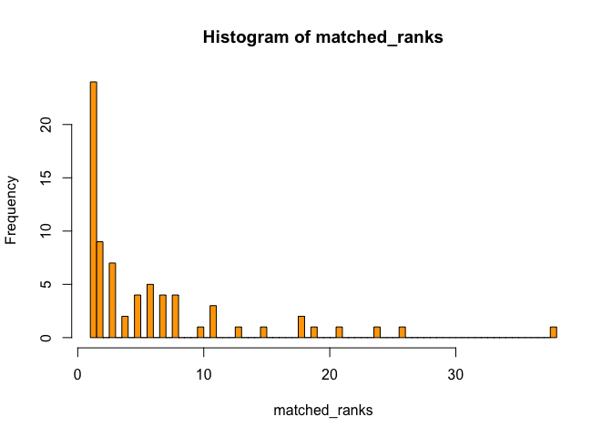

MiMentor Matching Algorithm
---------------------------

This algorithm assigns a compatibility score between each mentee and
mentor, sets a ranking of compatibility for each potential mentor and
implements the Top Trading Cycle algorithm through matchingR to find the
most optimal pairing (Shapley & Scarf, 1974).

<http://www.sciencedirect.com/science/article/pii/0304406874900330?via%3Dihub>

### Libraries

    library(tidyverse)

    ## Loading tidyverse: ggplot2
    ## Loading tidyverse: tibble
    ## Loading tidyverse: tidyr
    ## Loading tidyverse: readr
    ## Loading tidyverse: purrr
    ## Loading tidyverse: dplyr

    ## Conflicts with tidy packages ----------------------------------------------

    ## filter(): dplyr, stats
    ## lag():    dplyr, stats

    library(matchingR)

    ## Loading required package: Rcpp

    library(knitr)

### Function bank

    matchcat <- function(a,b){ #score the compatibility between two individuals based on multiple choice questions such as majors, industries, regions, etc.
        catsa <- (a %>% strsplit(split=', '))[[1]] #split categories described in form by commas
        catsb <- (b %>% strsplit(split=', '))[[1]]
        missing <- vector()
        for(i in catsa){
            if (i %in% catsa && !(i %in% catsb)){
                missing <- append(missing, i) #append every category present present in the mentee's form that's absent in the mentors' forms to missing 
            }
        }
        return(1-length(missing)/length(catsa)) #return ratio as score
    }

    match_score <- function(a,b){ #mentee a with respect to mentor b
        sheeta <- sheet21[rownames(sheet21)==a,]
        sheetb <- sheet49[rownames(sheet49)==b,]
        
        eval_class <- 0 #default scores = 0
        eval_gender <- 0
        eval_majors <- 0
        eval_interests <- 0
        eval_country <- 0
        eval_region <- 0
        
        
        if(sheeta$pref_class == 'no preference'){ #set score to 0.5 if no class preference
            eval_class <- 0.5 #this is actually irrelevnat since class is not considered for those who didn't set a preference
        }else if(sheetb$class == sheeta$pref_class){
            eval_class <- 1
        }
        
        if(sheeta$gender == sheetb$gender){
            eval_gender = 1    # Same gender -> score = 1. Otherwise 0.
        }else if(!(sheeta$gender%in%c('Male','Female'))){
            if(!(sheetb$gender%in%c('Male','Female'))){
                eval_gender = 1 # Those who filled Other get good Gender Score with each other
            }
        }
        
        eval_majors <- matchcat(sheeta$majors,sheetb$majors)
        eval_interests <- matchcat(sheeta$industries,sheetb$industries)
        
        if(sheeta$country == sheetb$country){
            eval_country = 1 # matching first countres equals 1 point
        }else if(sheeta$country == sheetb$country2 | sheeta$country2 == sheetb$country){
            eval_country = 0.5 #matching first-second countries equals 0.5 points
        }else if(sheeta$country2 == sheetb$country2){
            eval_country = 0.25 #matching second countries equals 0.25 points
        }
        
        eval_region <- matchcat(sheeta$region,sheetb$region)
        
        
        prefvar1 <- eval(parse(text=paste0('eval_',sheeta$pref1))) #score for first priority
        prefvar2 <- eval(parse(text=paste0('eval_',sheeta$pref2))) #score for second priority
        prefvar3 <- eval(parse(text=paste0('eval_',sheeta$pref3))) #and so on
        prefvar4 <- eval(parse(text=paste0('eval_',sheeta$pref4)))
        prefvar5 <- eval(parse(text=paste0('eval_',sheeta$pref5)))
        
        
        if(sheeta$pref_class == 'no preference'){
            return(1.75**4 * prefvar1 + 1.75**3 * prefvar2 + 1.75**2 * prefvar3 + 1.75 * prefvar4 + prefvar5)
        }else{
            return(1.75**4 * prefvar1 + 1.75**3 * prefvar2 + 1.75**2 * prefvar3 + 1.75 * prefvar4 + prefvar5 + 1.75**5 * eval_class)
        }
    } #compute final score as sum(s_i*1.75^(5-p_i)) where s_i is the score for each element i and p_i is its priority.

    vec_score <- Vectorize(match_score)

### Read and process mock data

    sheet1 <- read.csv('test_data.csv',stringsAsFactors = FALSE)
    sheet21 <- sheet1[sheet1$class == 2021,]
    sheet49 <- sheet1[sheet1$class != 2021,]
    rownames(sheet21) <- 1:72
    rownames(sheet49) <- 1:72

### Create compatibility ranking matrix based on compatbility scores between each mentee and each potential mentor

    rank_table <- data.frame(matrix(NA, nrow = nrow(sheet21), ncol = nrow(sheet49)),row.names = rownames(sheet21))

    for(i in rownames(sheet21)){
        rank_table[i,] <- rownames(sheet49)[vec_score(i,rownames(sheet49)) %>% order %>% rev]
    }

    rank_matrix <- rank_table %>% unname %>% as.matrix() %>% apply(1,as.numeric)

### Apply Top Trading Cycle Algorithm, check for stable solution

    results <- toptrading(pref = rank_matrix)
    matched <- as.data.frame(toptrading(pref = rank_matrix))
    matched$mentee <- sheet21$name
    matched$mentee_email <- sheet21$email
    matched$mentor <- sheet49$name[matched$V1]
    matched$mentor_email <- sheet49$email[matched$V1]
    matched <- matched[colnames(matched)!='V1']

    toptrading.checkStability(pref = rank_matrix,matchings =results)

    ## [1] TRUE

### Plot histogram of the ranking of each matched mentor with respect to its mentee.

    matched_ranks <- numeric()

    for(i in 1:nrow(sheet21)){
        matched_ranks[i] <- which(results[i,] == rank_table[i,])
    }

    matched$rank <- matched_ranks

    hist(matched_ranks,breaks=62,col='orange') #average rank of the mentor assigned for each mentee as a measure of success of matching

### Output summary of matches with information about mentees provided to each assigned mentor

<table>
<thead>
<tr class="header">
<th></th>
<th align="left">mentor</th>
<th align="left">mentor_email</th>
<th align="left">mentee</th>
<th align="left">mentee_email</th>
<th align="left">mentee_gender</th>
<th align="left">mentee_majors</th>
<th align="left">mentee_industries</th>
<th align="left">mentee_region</th>
<th align="left">mentee_country</th>
<th align="left">mentee_country2</th>
</tr>
</thead>
<tbody>
<tr class="odd">
<td>67</td>
<td align="left">Erica</td>
<td align="left"><a href="mailto:erica@minerva.kgi.edu">erica@minerva.kgi.edu</a></td>
<td align="left">Anthony</td>
<td align="left"><a href="mailto:anthony@minerva.kgi.edu">anthony@minerva.kgi.edu</a></td>
<td align="left">Male</td>
<td align="left">Business, Social Sciences, Computational Sciences</td>
<td align="left">Accounting &amp; Banking &amp; Finance, Business &amp; Consulting &amp; Management, Government &amp; Public Policy, Law, Social Science Research</td>
<td align="left">East Asia</td>
<td align="left">China</td>
<td align="left"></td>
</tr>
<tr class="even">
<td>68</td>
<td align="left">Sally</td>
<td align="left"><a href="mailto:sally@minerva.kgi.edu">sally@minerva.kgi.edu</a></td>
<td align="left">Oliver</td>
<td align="left"><a href="mailto:oliver@minerva.kgi.edu">oliver@minerva.kgi.edu</a></td>
<td align="left">Male</td>
<td align="left">Computational Sciences</td>
<td align="left">Business &amp; Consulting &amp; Management, Technology</td>
<td align="left">South East Asia</td>
<td align="left">Vietnam</td>
<td align="left"></td>
</tr>
<tr class="odd">
<td>69</td>
<td align="left">Tammy</td>
<td align="left"><a href="mailto:tammy@minerva.kgi.edu">tammy@minerva.kgi.edu</a></td>
<td align="left">Jeffrey</td>
<td align="left"><a href="mailto:jeffrey@minerva.kgi.edu">jeffrey@minerva.kgi.edu</a></td>
<td align="left">Male</td>
<td align="left">Natural Sciences</td>
<td align="left">Environment &amp; Agriculture, Startups &amp; Enterpreneurship, STEM Research</td>
<td align="left">Eastern Europe</td>
<td align="left">Kosovo</td>
<td align="left">Kosovo</td>
</tr>
<tr class="even">
<td>70</td>
<td align="left">Amber</td>
<td align="left"><a href="mailto:amber@minerva.kgi.edu">amber@minerva.kgi.edu</a></td>
<td align="left">Jack</td>
<td align="left"><a href="mailto:jack@minerva.kgi.edu">jack@minerva.kgi.edu</a></td>
<td align="left">Male</td>
<td align="left">Arts and Humanities, Computational Sciences</td>
<td align="left">Engeneering &amp; Manufacturing, STEM Research</td>
<td align="left">East Asia</td>
<td align="left">Korea, Republic of (South Korea)</td>
<td align="left">United States of America (USA)</td>
</tr>
<tr class="odd">
<td>71</td>
<td align="left">Allison</td>
<td align="left"><a href="mailto:allison@minerva.kgi.edu">allison@minerva.kgi.edu</a></td>
<td align="left">Joe</td>
<td align="left"><a href="mailto:joe@minerva.kgi.edu">joe@minerva.kgi.edu</a></td>
<td align="left">Male</td>
<td align="left">Business, Computational Sciences</td>
<td align="left">Accounting &amp; Banking &amp; Finance, Business &amp; Consulting &amp; Management, Startups &amp; Enterpreneurship, Technology</td>
<td align="left">Latin America</td>
<td align="left">Brazil</td>
<td align="left"></td>
</tr>
<tr class="even">
<td>72</td>
<td align="left">Harold</td>
<td align="left"><a href="mailto:harold@minerva.kgi.edu">harold@minerva.kgi.edu</a></td>
<td align="left">Eugene</td>
<td align="left"><a href="mailto:eugene@minerva.kgi.edu">eugene@minerva.kgi.edu</a></td>
<td align="left">Male</td>
<td align="left">Social Sciences, Computational Sciences</td>
<td align="left">Engeneering &amp; Manufacturing, Government &amp; Public Policy, Social Enterprise &amp; International Development, Technology</td>
<td align="left">South East Asia</td>
<td align="left">Pakistan</td>
<td align="left"></td>
</tr>
</tbody>
</table>
